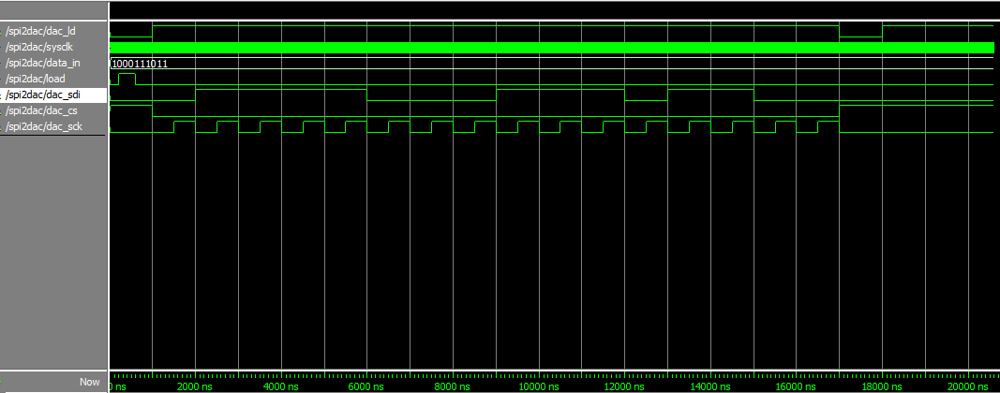
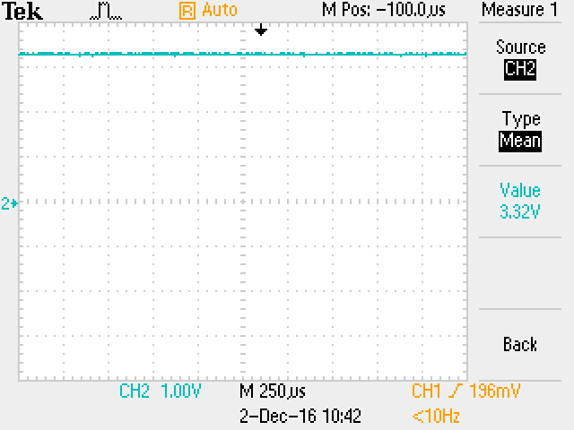
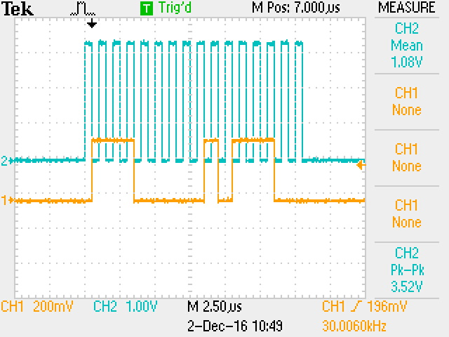

# Experiment 10: Interface with the DAC

The first experiment in part 4 of this lab introduced us to the MCP4911 Digital-to-Analog Converter, a chip located on the add-on card that converts a digital binary number into an analog signal.

### The DAC datasheet

#### Purpose of each pin

Pin | Description
--- | -----------
Vdd | Supply Voltage Input (2.7V to 5.5V)
CS  | Chip Select Input
SCK | Serial Clock Input
SDI | Serial Data Input
LDAC| Latch DAC Input. This pin is used to transfer the input register to the output register. Active low.
Vref| Voltage Reference Input
Vss | Ground
Vout| DAC Analog Output

#### The operation of SDI

The first four bits sent on SDI are configuration bits:

1. Write to DAC register if 0, otherwise ignore command
2. Buffered if set
3. Output Gain Selection bit (1x if 1, 2x if 0)
4. Output Shutdown Control bit (1 for active, 0 for shutdown)

The following 8 to 12 bits carry the digital data to be converted to analog.

### Timing diagram

The expected diagram for a 10-bit word with a value of 0x23B is as follows. First 4 configuration bits, then the data.

0x23B --> 0b1000111011

Cycle   | 1 | 2 | 3 | 4 | 5 | 6 | 7 | 8 | 9 |10 |11 |12 |13 |14
--------|---|---|---|---|---|---|---|---|---|---|---|---|---|---
**SDI** | 0 | 1 | 1 | 1 | 1 | 0 | 0 | 0 | 1 | 1 | 1 | 0 | 1 | 1

#### Simulation



The simulated timing diagram is as we expected. A summary of what happens:

- data_in is set up to 0x23B
- the load pin is pulsed on the spi2dac module
- the DAC data latch is brought high
- the DAC is activated with the CS (chip select) pin
- the SDI pin sends the configuration bits
- the SDI pin sends the data
- the DAC data latch is brought low to pass the data on to V<sub>OUT</sub>

### Testing the DAC

We wired the 10 switches on the DE1 board to *data_in* with some simple code, in order to test the DAC chip using an oscilloscope.
```verilog
module ex10_top(SW, CLOCK_50, DAC_CS, DAC_SDI, DAC_LD, DAC_SCK);

	input [9:0] SW;
	input CLOCK_50;

	output DAC_CS;
	output DAC_SDI;
	output DAC_LD;
	output DAC_SCK;

	wire clk_10k;

	clockdiv_5000 CLKDIV (CLOCK_50, clk_10k);

	spi2dac DAC (CLOCK_50, SW, clk_10k, DAC_SDI, DAC_CS, DAC_SCK, DAC_LD);

endmodule
```

With all the switches set to 1, giving a hex value of 0x3FF, we found the output voltage of the DAC to be very close to 3.3 V. For any other switches value, there was a linear relationship between SW[9:0] and V<sub>OUT</sub>



We then examined the SDI and SCK pins using the oscilloscope. Both behaved exactly the same as in the simulations.

CH1: SDI

CH2: SCK


